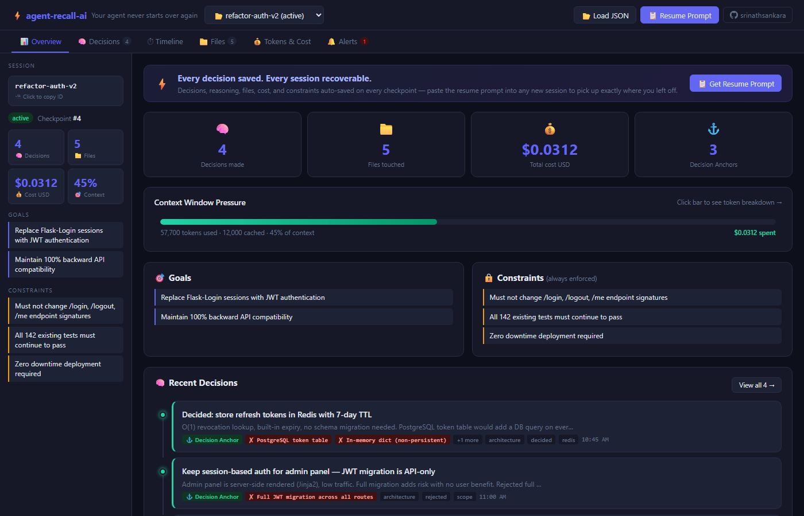
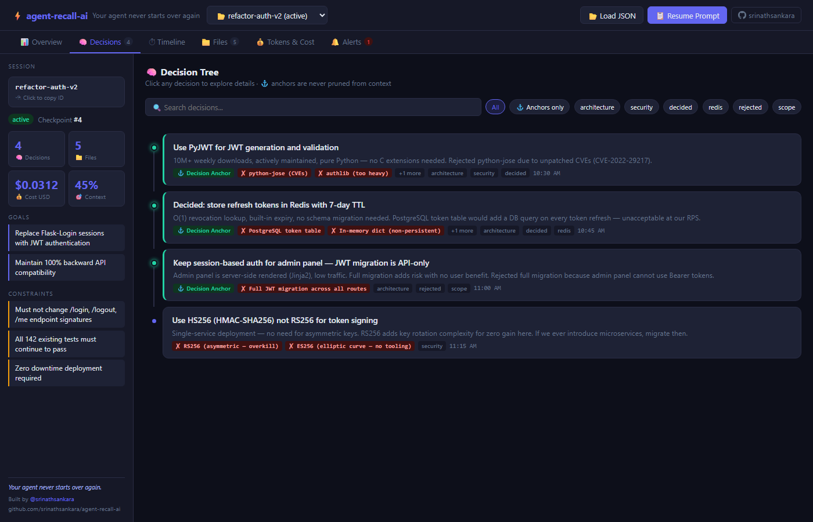
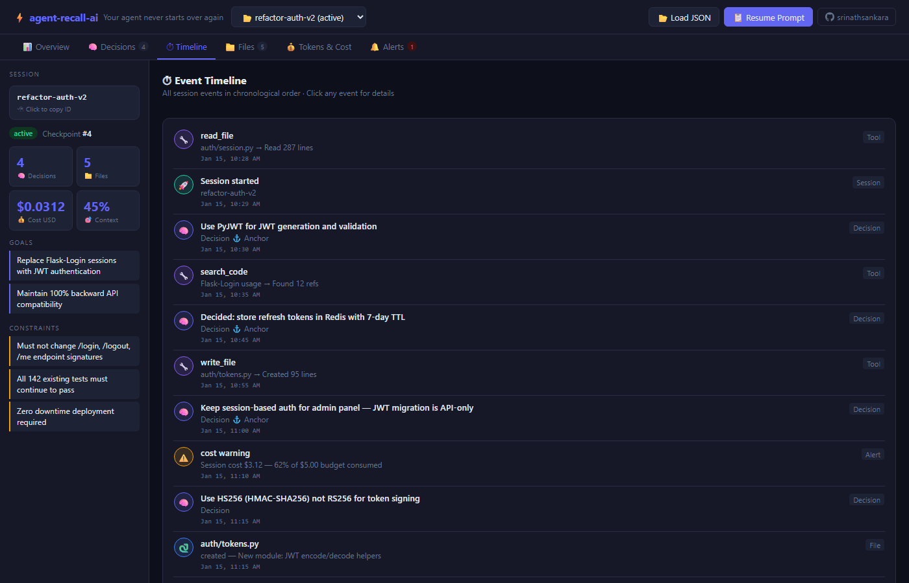
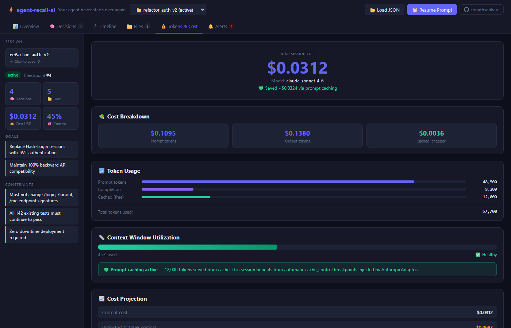
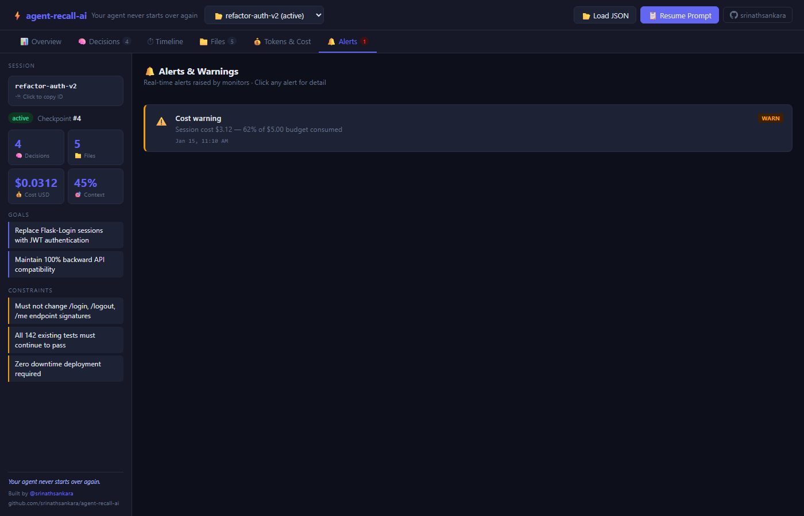

# agent-recall-ai

> **Your AI agent died mid-task. This is how it comes back.**

[](https://pypi.org/project/agent-recall-ai/)
[](https://www.python.org/)
[](https://github.com/srinathsankara/agent-recall-ai/actions)
[](LICENSE)
[](https://github.com/srinathsankara/agent-recall-ai)

---

## What is this for? (non-technical version)

Imagine you ask an AI assistant to help you with a big project — writing a report, refactoring code, building an API. It works away for an hour, makes dozens of decisions, and then... **it runs out of memory and forgets everything it was doing**. When you start a new conversation, you're back to square one.

**agent-recall-ai is an auto-save for AI agents.**

Every decision the agent makes, every file it touches, every constraint you gave it — all saved automatically in a structured format. When the session dies, you get a compact briefing that any AI can read to pick up exactly where it left off.

**Zero code changes for Claude Code users:**

```bash
pip install agent-recall-ai
agent-recall-ai install-hooks
```

That's it. Every Claude Code session is now automatically checkpointed at the end of each response. Your work is protected.

---

## The problem is real — it's in every framework's GitHub issues

| Framework | Open issue |
|---|---|
| OpenAI Codex | [#3997](https://github.com/openai/codex/issues/3997) — *"Session dies halfway, starts from scratch"* |
| Claude Code | [#40286](https://github.com/anthropics/claude-code/issues/40286) — *"Lost all context at 80K tokens"* |
| Google ADK | [#1738](https://github.com/google/adk-python/issues/1738) — *"No checkpoint/resume support"* |
| Microsoft Copilot | [#1535](https://github.com/microsoft/copilot-intellij-feedback/issues/1535) — *"Context reset mid-refactor"* |
| Kiro | [#4976](https://github.com/kirodotdev/Kiro/issues/4976) — *"Long tasks need session persistence"* |

The context window fills. The agent dies. You restart from zero — losing every decision, every rejected alternative, every hard-won constraint.

**agent-recall-ai solves this.** It snapshots your agent's reasoning state in a format designed for cold revival, not just compression.

---

## Zero-code protection for Claude Code

```bash
pip install agent-recall-ai
agent-recall-ai install-hooks          # adds a Stop hook to .claude/settings.json
```

Every Claude Code session now auto-saves a checkpoint when it ends.
No code changes. No API keys. Resume any session:

```bash
agent-recall-ai resume <session-name>
```

Works with **Cursor** and **Windsurf** too: `--tool cursor` / `--tool windsurf`

---

## Quick start — under 30 seconds

```bash
pip install agent-recall-ai
```

```python
from agent_recall_ai import Checkpoint

with Checkpoint("refactor-auth") as cp:
    cp.set_goal("Replace python-jose with PyJWT")
    cp.add_constraint("Do not break the public API")
    cp.record_decision(
        "Use PyJWT",
        reasoning="Actively maintained; python-jose has unpatched CVEs",
        alternatives_rejected=["python-jose", "authlib"],
    )
    cp.record_file_modified("auth/tokens.py")
    cp.record_tokens(prompt=18000, completion=2000)
    # State auto-saves to .agent-recall-ai/
```

When the context window fills (or the process dies), resume instantly:

```python
from agent_recall_ai import resume

state = resume("refactor-auth")
print(state.resume_prompt())
```

```
## Resuming Agent Session
**Session:** refactor-auth  |  **Checkpoint:** #3
**Started:** 2025-04-28 14:22 UTC

### Goals
- Replace python-jose with PyJWT

### Active Constraints
- Do not break the public API

### Decisions Made
- **Use PyJWT**
  Reason: Actively maintained; python-jose has unpatched CVEs
  Rejected: python-jose, authlib

### Files Modified
- `auth/tokens.py`

**Token usage so far:** 20,000 tokens  |  **Cost:** $0.0014
```

That's it. No server. No config. No framework lock-in.

---

## How it works — the Hydration Flow

```mermaid
graph TD
    subgraph Session["Agent Live Session"]
        A([Agent starts task]) --> B[Goals and Constraints set]
        B --> C{Work happens}
        C --> D[record_decision]
        C --> E[record_file_modified]
        C --> F[record_tokens]
        D & E & F --> G[(Checkpoint State\nauto-saved to disk)]
    end

    subgraph Death["Session Death"]
        G -->|Context limit hit| H([Context window full])
        H --> I([Session terminated])
    end

    subgraph Hydration["Hydration Flow — Cold Revival"]
        I --> J["resume() loads state from disk"]
        J --> K["resume_prompt() builds structured recap"]
        K --> L{New context window}
        L --> M["Goals restored"]
        L --> N["Decisions + reasoning restored"]
        L --> O["Files touched restored"]
        L --> P["Constraints restored"]
        L --> Q["Next steps restored"]
        M & N & O & P & Q --> R([Agent continues — no restart needed])
    end
```



The critical insight: a prose summary loses structured data. agent-recall-ai stores decisions as queryable records with reasoning and rejected alternatives. When the new session starts, it gets a compact, structured prompt — not a wall of summarized text.

---

## Compare: agent-recall-ai vs. the alternatives

| | **agent-recall-ai** | `/compact` | Manual summarization | LangGraph persistence |
|---|:---:|:---:|:---:|:---:|
| **Decision + reasoning preserved** | Structured | Best-effort prose | Usually lost | Tool calls only |
| **Constraints preserved** | Always | Often dropped | Rarely | Not tracked |
| **Alternatives rejected** | Per decision | No | No | No |
| **Files touched** | With action + desc | No | Sometimes | State only |
| **Cost tracking** | Per call, USD | No | No | No |
| **Real-time alerts** | 5 monitors | No | No | No |
| **Works offline** | SQLite default | Yes | Yes | Needs infra |
| **Framework agnostic** | Yes | Yes | Yes | LangGraph only |
| **PII redaction** | Pre-serialization | No | No | No |
| **Schema versioning** | BFS migration | No | No | No |
| **Multi-agent handoff** | `as_handoff()` | No | No | Graph edges only |

**Benchmark** (from `scripts/benchmark.py` — 60-turn sessions, 5 seeds):

| Strategy | Decision recall | Constraint recall | Resume tokens | Composite score |
|---|:---:|:---:|:---:|:---:|
| **agent-recall-ai** | **100%** | **100%** | **~270** | **100%** |
| Summarization | 56% | 71% | ~182 | 53% |
| Truncation | 100% | 13% | 47,175 | 64% |

Summarization uses fewer tokens but silently drops half your decisions and most of your constraints. Truncation consumes 47K tokens of context headroom while discarding everything from the first 80% of the session. agent-recall-ai's resume prompt is tiny (~270 tokens), perfectly structured, and loses nothing.

---

## Dashboard (AgentPrism)

Open `dashboard/index.html` in any browser — no server, no install. Click **Load Demo** to explore a live session. Every row, card, and stat is clickable — opens a detail panel with full context.

### Overview — goals, constraints, decisions, and context pressure at a glance



### Decision Tree — every "why" preserved, searchable, filterable



> **Decision Anchors** (⚓) are protected from context compression. Keywords like `decided`, `rejected`, `because`, `constraint` score 1.0 — they survive any pruning pass. The reasoning chain lives forever.

### Event Timeline — full session history in chronological order



### Tokens & Cost — real-time spend with prompt caching savings



### Alerts — real-time warnings from 5 built-in monitors



---

## Core features

### Async and decorator support

```python
# Async context manager — works with every modern agent framework
async with Checkpoint("my-async-agent") as cp:
    cp.set_goal("Analyze sales data")
    result = await openai_client.chat.completions.create(...)
    cp.record_tokens(prompt=result.usage.prompt_tokens,
                     completion=result.usage.completion_tokens)
# Non-blocking save via asyncio.to_thread on exit

# One-line decorator — sync or async, both work
@checkpoint("refactor-auth")
async def run_agent(goal: str, cp=None):
    cp.set_goal(goal)
    cp.add_constraint("Do not break the public API")
    result = await do_work()
    cp.record_decision("Chose streaming", reasoning="Lower latency")
    return result

# cp is injected automatically when declared as a parameter
await run_agent("Replace python-jose with PyJWT")
```

### Decision Anchors — the reasoning chain is sacred

Every decision is stored with its full reasoning and alternatives considered:

```python
cp.record_decision(
    "Use JWT in httpOnly cookie",
    reasoning="CSRF risk is lower than XSS at our scale",
    alternatives_rejected=["localStorage", "sessionStorage"],
    tags=["security", "auth"],
)
```

When context is compressed, **Decision Anchors are never pruned**. Keywords like `decided`, `rejected`, `because`, `constraint`, `must not` lock a message in memory with a score of 1.0. You chose PyJWT three weeks and 200K tokens ago — the new session still knows why.

### Real-time monitors — alerts before catastrophe

```python
from agent_recall_ai import Checkpoint, CostMonitor, TokenMonitor, DriftMonitor

with Checkpoint(
    "long-refactor",
    monitors=[
        CostMonitor(budget_usd=5.00),               # raises CostBudgetExceeded at $5
        TokenMonitor(warn_at=0.70, compress_at=0.88),  # alerts at 70%/88% fill
        DriftMonitor(),                              # detects constraint violations
    ],
) as cp:
    ...
```

| Monitor | Fires when |
|---|---|
| `CostMonitor` | Spend exceeds budget; raises `CostBudgetExceeded` |
| `TokenMonitor` | Context fills past warning/compression thresholds |
| `DriftMonitor` | Agent output contradicts recorded constraints |
| `PackageHallucinationMonitor` | Tool calls reference non-existent packages |
| `ToolBloatMonitor` | Repetitive tool calls suggest an infinite loop |

### Enterprise privacy — secrets never hit disk

```python
from agent_recall_ai.privacy import PIIRedactor, SensitivityLevel

redactor = PIIRedactor(sensitivity=SensitivityLevel.HIGH)
# Scans for: API keys, passwords, emails, SSNs, credit cards, private IPs

with Checkpoint("prod-deploy", redactor=redactor) as cp:
    cp.record_decision(
        "Rotate DB credentials",
        reasoning="Old password was SuperSecret123 — now rotated",
    )
    # Saved to disk: reasoning="... [REDACTED:password] — now rotated"
    # In memory (live agent): original value retained
```

14 built-in regex PII categories. Custom rules via `RedactionRule`. `dry_run=True` for audit mode. `hash_redacted=True` for deterministic correlation tokens across checkpoints.

**Microsoft Presidio upgrade** (NER-based, catches contextual PII like names and locations):

```python
from agent_recall_ai.privacy.presidio_backend import PresidioBackend
from agent_recall_ai.privacy import PIIRedactor

backend = PresidioBackend(entities=["PERSON", "LOCATION", "EMAIL_ADDRESS", "PHONE_NUMBER"])
redactor = PIIRedactor(sensitivity=SensitivityLevel.HIGH, extra_backend=backend)
# Now catches: "Contact John Smith at his office in New York"
```

Install: `pip install 'agent-recall-ai[presidio]'` + `python -m spacy download en_core_web_lg`

### Schema versioning — checkpoints survive upgrades

```python
from agent_recall_ai.privacy import VersionedSchema

with Checkpoint("future-proof", schema=VersionedSchema()) as cp:
    ...
# Every checkpoint carries schema_version="1.0.0"
# BFS migration graph handles forward AND backward compatibility
# A checkpoint saved today loads cleanly 6 months from now
```

### Semantic compression — protect what matters

```python
from agent_recall_ai.core.semantic_pruner import SemanticPruner

pruner = SemanticPruner()
compressed, stats = pruner.compress_context(messages, target_tokens=4096)
print(stats)
# {"original_tokens": 22000, "compressed_tokens": 4096,
#  "anchors_protected": 7, "compression_ratio": 0.81}
```

Decision Anchors score 1.0 and are never dropped. Other messages are ranked by embedding similarity (or keyword importance when sentence-transformers is not installed). Typical result: 80% token reduction, 95%+ reasoning retention.

### Framework adapters — 6 frameworks, zero lock-in

```python
# OpenAI SDK — with ConversationRepair for orphaned tool_call IDs
from agent_recall_ai.adapters import OpenAIAdapter
adapter = OpenAIAdapter(cp, repair_conversations=True)
client = adapter.wrap(openai.OpenAI())
# If the session was interrupted mid-tool-call, the history is auto-repaired

# Anthropic SDK — automatic prompt caching (90% cost reduction)
from agent_recall_ai.adapters import AnthropicAdapter
adapter = AnthropicAdapter(cp)   # enable_prompt_caching=True by default
# Injects cache_control breakpoints on system, tools, and last user message
# Pre-counts tokens before each call → state.metadata["pre_inference_tokens"]
client = adapter.wrap(anthropic.Anthropic())

# LangChain
from agent_recall_ai.adapters import LangChainAdapter
handler = LangChainAdapter(cp).as_callback()

# CrewAI — records each task completion as a Decision Anchor
from agent_recall_ai.adapters import CrewAIAdapter
crew = CrewAIAdapter(cp).wrap(Crew(agents=[...], tasks=[...]))
result = crew.kickoff()  # every task boundary auto-checkpointed

# smolagents (HuggingFace) — records every reasoning step
from agent_recall_ai.adapters import smolagentsAdapter
agent = smolagentsAdapter(cp).wrap(CodeAgent(tools=[...], model=model))
result = agent.run("Analyze the sales data in data.csv")
```

| Framework | Stars | Adapter |
|---|:---:|---|
| OpenAI SDK | — | `OpenAIAdapter` + ConversationRepair |
| Anthropic SDK | — | `AnthropicAdapter` + prompt caching + pre-inference token count |
| **LangGraph** | **47K** | **`LangGraphAdapter`** — drop-in `BaseCheckpointSaver` |
| LangChain | 90K | `LangChainAdapter` |
| **CrewAI** | **26K** | `CrewAIAdapter` |
| **smolagents** | **12K** | `smolagentsAdapter` |
| PydanticAI | — | coming soon — [PR welcome](CONTRIBUTING.md) |
| AutoGen | 38K | coming soon — [PR welcome](CONTRIBUTING.md) |

### LangGraph drop-in — one line change

If you're already using LangGraph, agent-recall-ai is a **zero-effort drop-in**:

```python
from langgraph.graph import StateGraph
from agent_recall_ai.adapters import LangGraphAdapter

# Before: MemorySaver() or SqliteSaver()
# After:
checkpointer = LangGraphAdapter.from_sqlite("checkpoints.db")

graph = builder.compile(checkpointer=checkpointer)
config = {"configurable": {"thread_id": "my-session"}}

# Every .invoke() is now auto-checkpointed with full reasoning state
result = graph.invoke({"messages": [...]}, config)

# After session death — resumes from exact checkpoint
result = graph.invoke(None, config)
```

All three storage backends supported:
- `LangGraphAdapter.from_memory()` — in-process (tests, ephemeral tasks)  
- `LangGraphAdapter.from_sqlite("path.db")` — single-machine production  
- `LangGraphAdapter.from_redis("redis://...")` — distributed, multi-agent

#### Thread forking — explore alternatives without losing history

```python
# Fork the main session to explore an alternative reasoning path
checkpointer.fork("main-session", "alt-branch-1")

alt_config = {"configurable": {"thread_id": "alt-branch-1"}}
alt_result = graph.invoke({"messages": [...]}, alt_config)
# main-session is unchanged; alt-branch-1 diverges from the same checkpoint
```

Forking also works directly on `Checkpoint` instances:

```python
with Checkpoint("main-task") as cp:
    cp.set_goal("Refactor auth module")
    cp.record_decision("Use PyJWT", reasoning="Better maintained")

    # Explore a different approach
    alt = cp.fork("main-task-alt")
    alt.record_decision("Try python-jose instead", reasoning="Lighter weight")
    alt.save()
    # parent unchanged, alt has all parent state plus new decision
```

### OpenTelemetry export — traces in Datadog, Jaeger, Grafana

```python
from agent_recall_ai.exporters import OTLPExporter

# Jaeger (local dev)
exporter = OTLPExporter(endpoint="http://localhost:4317", insecure=True)

# Datadog APM
from agent_recall_ai.exporters import DatadogExporter
exporter = DatadogExporter(env="production", service="my-agent")

with Checkpoint("prod-task") as cp:
    exporter.attach(cp)   # auto-exports a trace on every save
    ...

# Or export after-the-fact
exporter.export_session(cp.state)
```

Each session produces a span hierarchy:

```
checkpoint:{seq}
├── decision:{id}       attributes: summary, reasoning, alternatives_rejected, tags
├── tool:{name}         attributes: input_summary, output_tokens, compressed
└── alert:{type}        attributes: severity, message
```

Token usage, cost, cache savings, and context utilization appear as span attributes — queryable in any OTLP backend.

Install: `pip install 'agent-recall-ai[otlp-grpc]'` or `pip install 'agent-recall-ai[otlp-http]'`

### Redis for production / distributed agents

```python
from agent_recall_ai.persistence.redis_provider import RedisProvider

store = RedisProvider(url="redis://redis.internal:6379", prefix="myapp")
with Checkpoint("prod-task", store=store) as cp:
    ...
# TTL: 7 days (active), 1 day (completed)
# Publishes events to myapp:events on each save
# Sorted index for fast session listing
```

### Multi-agent handoff

```python
# Agent 1 completes its subtask
payload = cp.as_handoff()
# {"session_id": "...", "decisions": [...], "constraints": [...],
#  "files_modified": [...], "next_steps": [...], "cost_usd": 0.14}

# Agent 2 picks up exactly where Agent 1 left off
with Checkpoint("agent-2", store=store) as cp2:
    cp2.set_context(f"Continuing from agent-1 (${payload['cost_usd']:.2f} spent)")
    for d in payload["decisions"]:
        cp2.record_decision(d["summary"], reasoning=d["reasoning"])
```

---

## CLI

```bash
# Session management
agent-recall-ai list                            # all sessions (color-coded by status)
agent-recall-ai list --status active            # filter by status
agent-recall-ai inspect refactor-auth           # full details with decisions, files, alerts
agent-recall-ai inspect refactor-auth --full    # every decision and tool call
agent-recall-ai resume  refactor-auth           # print resume prompt — paste into new session
agent-recall-ai export  refactor-auth --format json > state.json
agent-recall-ai export  refactor-auth --format handoff > handoff.json
agent-recall-ai export  refactor-auth --format agenttest > test_auth.py
agent-recall-ai delete  refactor-auth
agent-recall-ai status                          # total cost, token spend, session counts

# One-time setup (zero-code protection)
agent-recall-ai install-hooks                   # Claude Code
agent-recall-ai install-hooks --tool cursor     # Cursor
agent-recall-ai install-hooks --tool windsurf   # Windsurf
agent-recall-ai install-hooks --global          # install globally (all projects)
agent-recall-ai install-hooks --dry-run         # preview changes without writing
```

---

## Architecture

```
agent_recall_ai/
├── checkpoint.py            Primary API — Checkpoint context manager
├── core/
│   ├── state.py             TaskState (Pydantic v2), Decision, FileChange, Alert
│   ├── tracker.py           Token cost table (GPT-4o, Claude 3.5 Sonnet, etc.)
│   ├── compressor.py        Tool output + decision log compression
│   └── semantic_pruner.py   SemanticPruner with Decision Anchor protection
├── storage/
│   ├── disk.py              DiskStore — zero-config SQLite (default)
│   └── memory.py            MemoryStore — for tests
├── persistence/
│   ├── sqlite_provider.py   Full SQLite with decision_log full-text search
│   └── redis_provider.py    Redis with TTL, pub/sub, sorted index
├── monitors/                CostMonitor, TokenMonitor, DriftMonitor, ...
├── adapters/
│   ├── anthropic_adapter.py Prompt caching + pre-inference token count
│   ├── openai_adapter.py    ConversationRepair for orphaned tool_call IDs
│   ├── langgraph_adapter.py BaseCheckpointSaver drop-in + thread forking
│   ├── langchain_adapter.py CallbackHandler + MessageHistory
│   ├── crewai_adapter.py    kickoff() + task boundary instrumentation
│   └── smolagents_adapter.py run() + step() + log harvesting
├── exporters/
│   ├── otlp.py              OpenTelemetry spans → Datadog / Jaeger / Grafana
│   └── datadog.py           Datadog APM convenience wrapper
├── privacy/
│   ├── redactor.py          PIIRedactor — 14 categories, runs pre-serialization
│   ├── versioned_schema.py  VersionedSchema — BFS migration graph
│   └── presidio_backend.py  Optional NER-based PII via Microsoft Presidio
└── cli/main.py              Typer CLI (list, inspect, resume, export, delete, install-hooks)
```

Key design decisions and why:

- **Pydantic v2** for `TaskState` — type-safe, fast JSON via `model_dump_json()`, validates on load
- **Explicit, not magic** — no ContextVar injection; `cp.record_decision()` is intentional
- **Decision Anchors are never pruned** — the reasoning chain is irreplaceable; token count isn't
- **Secrets never hit storage** — `PIIRedactor` runs on a deep copy before `store.save()`
- **SQLite default, Redis optional** — zero config for local dev; Redis for distributed prod
- **Adapter plugin registry** — `@register_adapter("name")` — add frameworks without forking

---

## Installation

```bash
pip install agent-recall-ai              # minimal
pip install agent-recall-ai[redis]       # + Redis support
pip install agent-recall-ai[langchain]   # + LangChain integration
pip install agent-recall-ai[langgraph]   # + LangGraph BaseCheckpointSaver
pip install agent-recall-ai[crewai]      # + CrewAI integration
pip install agent-recall-ai[smolagents]  # + smolagents integration
pip install agent-recall-ai[semantic]    # + embedding-based compression
pip install agent-recall-ai[otlp-grpc]  # + OpenTelemetry gRPC export
pip install agent-recall-ai[otlp-http]  # + OpenTelemetry HTTP export
pip install agent-recall-ai[presidio]   # + NER-based PII (Microsoft Presidio)
pip install agent-recall-ai[all]        # everything

# Development
pip install -e ".[dev]"
pytest tests/ -v    # 289 passing, 17 skipped (optional deps)
```

---

## Why not just use `/compact`?

`/compact` summarizes your conversation into a prose block. Better than nothing, but:

1. **Structured reasoning becomes prose.** "Use PyJWT" is a sentence in a summary, not a queryable decision with alternatives and rationale.
2. **Constraints disappear.** "Must not break the public API" was said 40K tokens ago. Summarization drops it.
3. **It's reactive, not proactive.** You remember to run it *after* the context fills. agent-recall-ai saves on every 10th token update automatically.
4. **No cost, file, or next-step tracking.** No multi-agent handoff.
5. **Nothing to test.** agent-recall-ai's state is a Pydantic model — every field is typed, validated, and testable.

agent-recall-ai doesn't replace `/compact` — it eliminates the need for it.

---

## Add the badge to your project

```markdown
[](https://github.com/srinathsankara/agent-recall-ai)
```

[](https://github.com/srinathsankara/agent-recall-ai)

---

## License

MIT. See [LICENSE](LICENSE).

---

*Built to solve a real problem that has open GitHub issues in every major agent framework.
[File an issue](https://github.com/srinathsankara/agent-recall-ai/issues/new) if your agent died on something this should have caught.*

*Made by [@srinathsankara](https://github.com/srinathsankara)*
